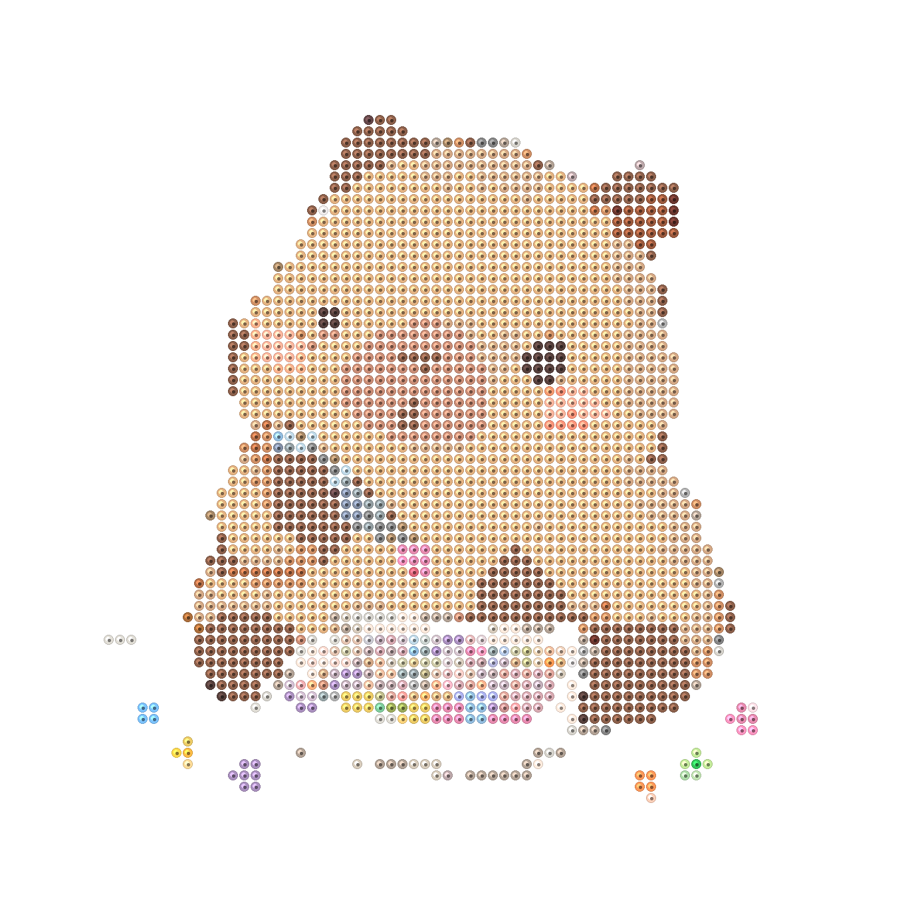

# 🧩 图豆 (Pindou Pattern Generator)

<p align="center">
  <picture>
    <source media="(prefers-color-scheme: dark)" srcset="assets/logo-perler-beads-dark.png">
    
  </picture>
</p>

<p align="center">
  <sub>项目 logo「拼豆卡皮巴拉」— 由图豆自己生成：80×80 · 6400 颗 · <a href="assets/logo-capybara-original.png">原图</a> · <a href="assets/logo-perler-blocks.png">方块版</a> · <a href="assets/logo-capybara-pattern-grid.png">施工图纸</a></sub>
</p>

任意图片 → MARD 色卡拼豆图纸。支持逐点取色 / 误差抖动 / 限制颜色，输出矢量 SVG（无限放大）+ 施工图纸 + 用豆清单 + 熨烫预览，提供 Web 界面和 CLI 两种用法。

## 快速开始

```bash
# Web 版 (推荐)
./run.sh                    # → http://127.0.0.1:8600

# CLI 版
python3 pindou.py 图片.png -W 80                   # 80 豆宽, 逐点取色
python3 pindou.py 照片.jpg -W 96 --mode dither     # 照片用误差抖动
python3 pindou.py 图.png --mode limited --colors 24  # 限制 24 色内
```

依赖: `pillow fastapi uvicorn python-multipart numpy requests`

## AI 像素化（可选，需自己配置 API）

「AI 像素化」开启后，照片会先由**图生图 AI 重绘成干净的像素画**（大块平涂、无噪点），再走正常的拼豆转换流程。效果：色块干净、杂色少、五官清晰；代价：**这是 AI 的再创作而非忠实转换**，姿势、花纹、背景细节可能被改动。

默认关闭。开启需要配置一个 OpenAI 兼容的图像编辑 API（支持 `POST /v1/images/edits` 的任意服务商或中转均可）：

1. 复制模板并填入你自己的凭据：

   ```bash
   cp .env.example .env
   # 编辑 .env, 填入你的 key 和接口地址
   ```

2. `.env` 两个必填项：

   | 变量 | 说明 |
   |---|---|
   | `OPENAI_API_KEY` | 你的 API key（在服务商后台创建） |
   | `OPENAI_BASE_URL` | 接口地址，官方为 `https://api.openai.com/v1`，中转/自建填对应地址 |

3. `.env` 已被 `.gitignore` 排除，**永远不要提交**；没有 `.env` 时其余功能不受影响，仅 AI 像素化会提示未配置。

CLI 对应参数：`--ai-pixel`（开关）、`--ai-pixel-grid N`（目标格数，默认 48）、`--ai-pixel-quality low|medium|high`（默认 low，最快最省）。

> 该功能会把上传的图片发送给你配置的 API 服务商，介意隐私的图片请勿开启；本机不运行任何图像模型。

## Web 功能

- **施工图纸** — canvas 渲染, 缩放/移动始终清晰; 29×29 标准拼豆板分板 + 5×5 红色定位线
- **按色施工** — 淡色底图定位 + 当前色高亮, 自由缩放平移, 单色完成打勾, 总进度条
- **精修** — 全 291 色选色器 (系列 × 色号二层分类 + 搜索), 点击换色, 撤销/还原, 同步全部产物
- **熨烫预览** — 三轴分类树: 熔合程度 × 单/双面 × 12 种表面纹理 (澡巾纹/菱格纹/华夫格/闪粉等), 实时渲染
- **算法可选** — LANCZOS / 区域主流色 / 内容自适应降采样, 孤立豆清理, 相似色合并

## 输出文件

| 文件 | 说明 |
|---|---|
| `pattern.svg` | 矢量预览 (无限放大) |
| `pattern_overview.svg` | 总览 + 大字图例 (备料) |
| `pattern_grid.svg` | 施工图纸: 色号/坐标/板框/图例 |
| `pattern_grid.png` | 位图版施工图纸 |
| `pattern.html` | A4 打印版 |
| `beads.csv` | 购豆清单 |
| `pattern.json` | 图案数据 (供按色施工/精修/熨烫预览) |

## 目录结构

```
pindou-generator/
├── pindou.py       # 核心引擎 + CLI
├── server.py       # FastAPI 后端 (端口 8600)
├── run.sh          # 一键启动
├── static/         # 前端 (原生 HTML/CSS/JS, 零构建)
├── palettes/       # MARD 291 色卡 (开源 beadcolors 数据集)
└── output/         # 生成结果 (gitignore)
```

## 转换算法

| 参数 | 说明 |
|---|---|
| `--algo plain` | LANCZOS 降采样 + CIEDE2000 逐点匹配 |
| `--algo mode` | 区域主流色采样: 色块锐利, 抑制噪点 |
| `--algo edge` | 内容自适应加权降采样 (边缘感知, 保形状) |
| `--algo mode4` | **4x 超采样多数投票** (借鉴 BeadCraft/PixArt-Beads 管线): LANCZOS 到 4 倍网格 → 量化 → 4×4 块多数投票, 混杂区退回平均色精确匹配。保真度 ≈ plain, 但色块更干净、色数更少 (省材料), 推荐 |
| `--mode dither` | Lab 空间误差抖动 (只扩散明度, 防色点噪声) |
| `--merge N` | 相似色合并 (CIEDE2000 < N 的近似色并入主流色) |
| `--despeckle N` | 孤立豆清理 (连通域 < N 的色块并入周围) |

> 色卡 HEX 为屏幕参考色, 实物受批次/光线影响, 大量备豆前请核对实体色卡。
